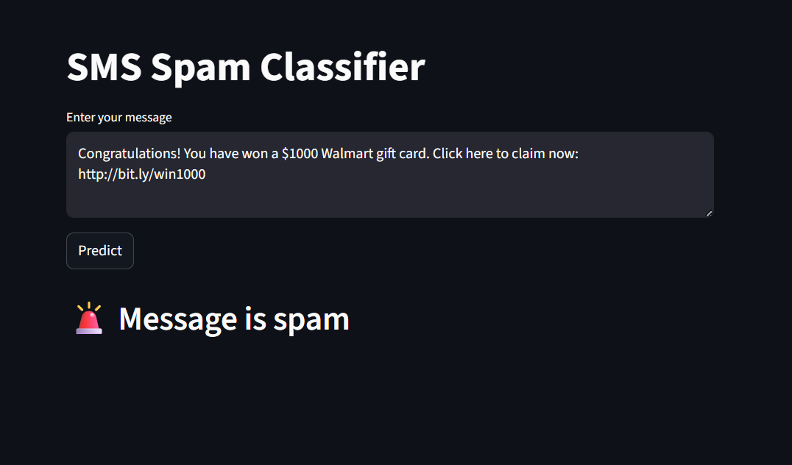
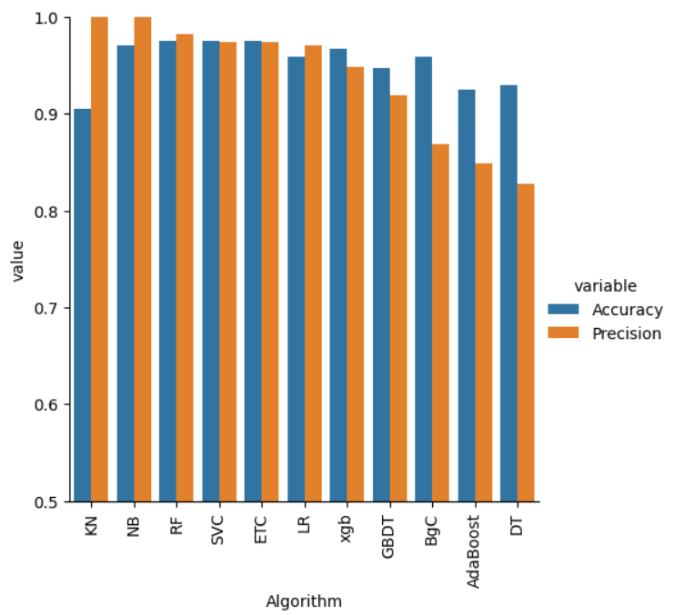
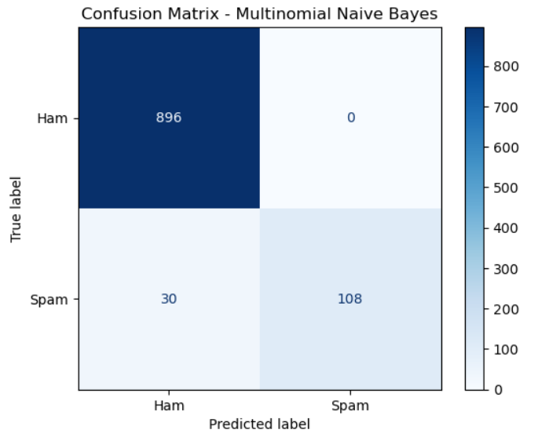

# SMS Spam Detector

An end-to-end Natural Language Processing (NLP) project that classifies SMS messages as **Spam** or **Not Spam** using TF-IDF vectorization and a Multinomial Naive Bayes classifier.  
The model is deployed as an interactive **Streamlit web application** for real-time spam detection.

---

## Web App Demo



Users can enter any SMS text and instantly receive spam/ham prediction.

---

## Model Comparison

Multiple machine learning algorithms were evaluated to identify the most reliable classifier for SMS spam detection.



| Model | Accuracy | Precision | Notes |
|------|---------|----------|------|
SVC | 97.58% | 97.48% | High accuracy |
KNN | 90.52% | **100%** | Lower recall |
**Multinomial Naive Bayes** | 97.09% | **100%** | ✅ Selected |
Decision Tree | 92.75% | 81.19% | Overfitting |
Logistic Regression | 95.84% | 97.03% | Stable |
Random Forest | **97.58%** | 98.29% | Complex |
AdaBoost | 92.46% | 84.88% | Moderate |
Bagging | 95.84% | 86.82% | Ensemble |
Extra Trees | 97.49% | 97.46% | Strong |
Gradient Boosting | 94.68% | 91.91% | Slower |
XGBoost | 96.71% | 94.83% | Advanced |

**Multinomial Naive Bayes** was chosen because it achieved **perfect precision (1.0)** while maintaining high accuracy, ensuring no legitimate SMS is marked as spam.

---

## NLP Processing Pipeline

SMS text is converted into numerical features through:

- Lowercasing  
- Tokenization  
- Stopword removal  
- Stemming (Porter Stemmer)  
- TF-IDF vectorization  

**Pipeline flow:**


SMS → Clean → Tokenize → Stem → TF-IDF → Naive Bayes → Prediction

---

##  Model Performance

**Final Model:** Multinomial Naive Bayes  

- Accuracy: **97.09%**  
- Precision: **100%**  
- Recall: ~78%  
- F1-Score: ~88–97%  

---

## Confusion Matrix



The model achieved **zero false positives**, meaning no legitimate (ham) messages were incorrectly classified as spam.  
This is critical for real-world spam filters where blocking genuine messages must be avoided.

---

##  Dataset

- SMS Spam Collection Dataset (Kaggle)  
- Labeled spam and ham SMS messages  
- Used for training and evaluation  

---

##  Project Workflow

1. Data cleaning and preprocessing  
2. Exploratory data analysis  
3. TF-IDF feature extraction  
4. Training multiple ML models  
5. Model comparison and selection  
6. Streamlit web app deployment  

---

## Setup

## 1. Clone the repo
```bash
git clone https://github.com/aryan-pandey00/spam-sms-detector.git 
cd sms-spam-classification
```

## 2. Install dependencies
```bash
pip install -r requirements.txt
```

## 3. Run the app
```bash
streamlit run app.py
```

## Tech Stack

- Python
- Scikit-learn
- NLTK
- Pandas / NumPy
- Matplotlib
- Streamlit
